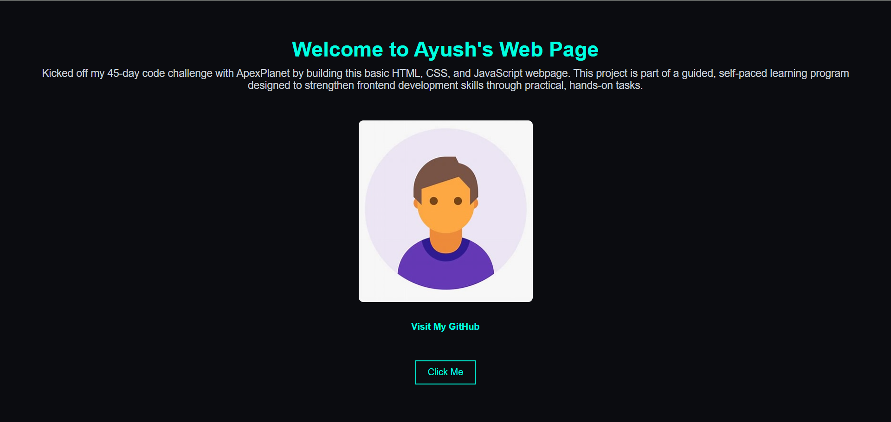

# Task 1 – Basic Web Page

This project was built as part of a **45-day self-paced web development program organized by ApexPlanet Software**, focused on learning HTML, CSS, and JavaScript through practical, hands-on tasks.

## 🔧 Tools Used:
- HTML
- CSS
- JavaScript

## 📄 Task Description:
Create a simple webpage with:
- Heading and paragraph
- An image
- A link
- A button that shows an alert
- Basic CSS styling

## 🌐 Live Preview:
(Not deployed yet)

## 📸 Screenshot:

## 📂 Author:
**Ayush Vitthal Fande**
